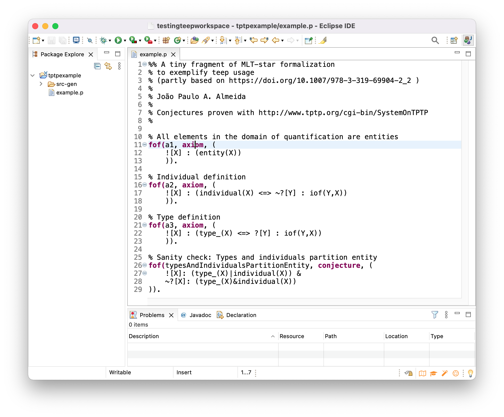
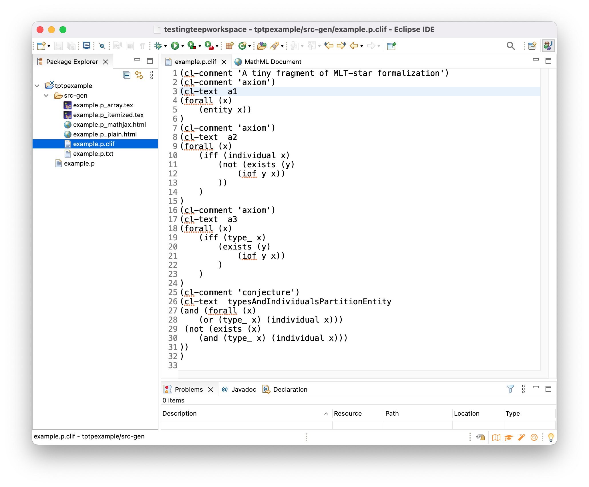
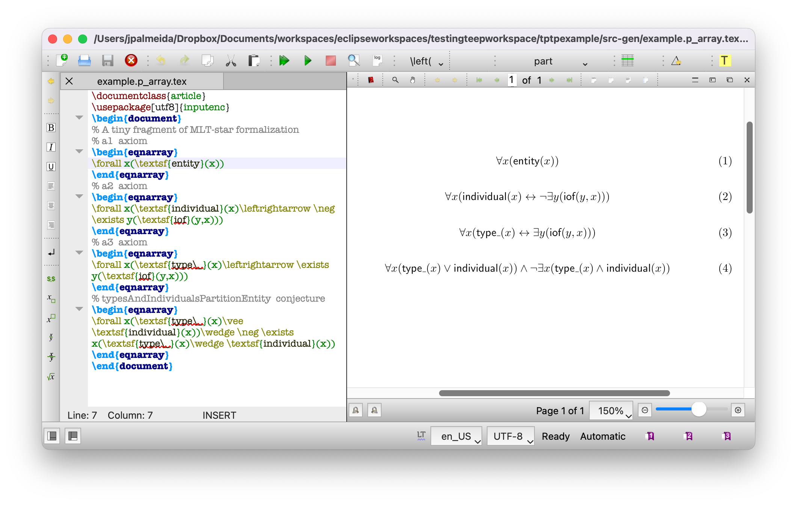

# A TPTP Editor as an Eclipse Plugin (teep)

Teep is an Eclipse plugin for a subset of the TPTP syntax (restricted to First-Order Formulas) which can be used with many theorem provers (see <https://www.tptp.org>). It supports syntax highlight and syntax verification.

Most importantly, from a specification in TPTP (with the `.p` extension), teep generates:

- [CLIF (the Common Logic Interchange Format)](https://www.iso.org/standard/66249.html)
- LaTeX equations
- HTML expressions with [MathML](https://www.w3.org/Math/)
- Plain-text ASCII content

## Maintenance

This project is maintained on a best-effort basis. It was designed for research projects at [NEMO/UFES](https://nemo.inf.ufes.br), and is being shared in the hope that it may help others.

The maintainer ([João Paulo A. Almeida](http://nemo.inf.ufes.br/jpalmeida)) unfortunately cannot commit to fixing bugs and adding features. There is no strict claim of conformance to the TPTP grammar, CLIF or any other standard.

Teep was developed with Xtext 2.25.0 and test under Eclipse 2021-09 (4.21.0).

(See <https://github.com/marklemay/tptpParser> for a different project unaffiliated with this and with a focus on a complete TPTP parser.)

## Installing

Open Eclipse and go to "Help->Install New Software..."

Select "Add..." and then "Archive..." Point to the `br.ufes.inf.nemo.teep.repository-1.0.0-SNAPSHOT.zip` file you downloaded from [releases](https://github.com/nemo-ufes/tptp-editor-eclipse-plugin/releases) (or directly [here](https://github.com/nemo-ufes/tptp-editor-eclipse-plugin/releases/download/v1.0.0-SNAPSHOT/br.ufes.inf.nemo.teep.repository-1.0.0-SNAPSHOT.zip)). You may optionally give a name to the repository (say "Teep local repository.")

Select then the "Tptp" feature and click "Next>" and "Finish". Eclipse will calculate all the required dependencies and install them. It will warn you that you are installing unsigned software. Click "Install Anyway" and restart Eclipse.

## Usage

In Eclipse, select "File->New->Project..." and create a "General" "Project".

Select "File->New->File..." and create a file with the extension `.p`. You will be asked to convert the project to an Xtext project. Click on "Yes". Your file will then be ready for editing.

Example TPTP specifications written in teep can be found in <https://github.com/nemo-ufes/ufo-types> and <https://github.com/nemo-ufes/mlt-ontology>. Many other TPTP files can be found at <https://www.tptp.org>.

When you save a `.p` file, teep will generate several output files under `src-gen` (`.clif`, `.tex`, `.html`, `.txt`).

Example in CLIF:

Example in LaTeX:

Example in HTML with MathML (generated MathML can be copied-and-pasted as equations in Word; for that, copy each `<math>`...`</math>` fragment and paste it as unformatted text in Word):

Example in plain-text ASCII:

Once you are ready, use theorem provers at [System on TPTP](http://www.tptp.org/cgi-bin/SystemOnTPTP). (Hint: only one conjecture at a time is admitted by the system, comment all conjectures not under scrutiny with `%`.)

If you find teep useful, please let us know <mailto:jpalmeida@ieee.org>.

## Limitations

Only part of the first-order fragment of the TPTP syntax is supported. In particular:

- There is no special support for pre-defined predicates/functors (such as `$less`, `$greater`, `$true`, `$false`).
- There is no support for the `include` directive.
- There is no support for quoted symbols.
- There is no support for `<=` reverse implication, `<~>` non-equivalence (XOR), `~|` negated disjunction (NOR), `~&` for negated conjunction (NAND).
- Only non-negative integers are supported.

Syntax verification does not check for unbound variables.

## Development

`mvn package` in `br.ufes.inf.nemo.teep.parent` produces (among many other files) a repository zip file under `br.ufes.inf.nemo.teep.repository\br.ufes.inf.nemo.teep.repository\target`.

## License

Distributed under the MIT License. See `LICENSE` for more information.
